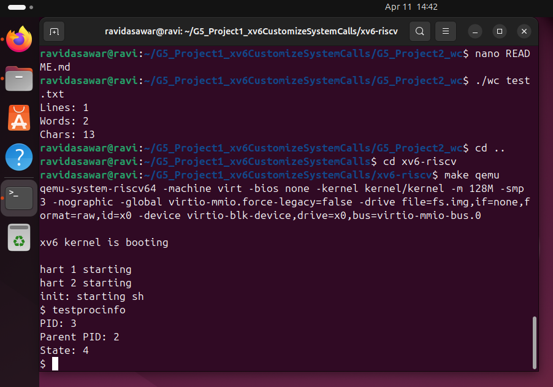

Project 1: xv6 System Call Customization

Description

In this project, we modified the xv6 operating system by adding a custom system call.

The system call "getprocessinfo" is implemented to display:

- Process ID (PID)
- Parent Process ID (PPID)
- Process State

---

Implementation Details

The following changes were made:

- Added system call in:
  
  - "kernel/sysproc.c"
  - "kernel/syscall.c"
  - "kernel/syscall.h"

- Updated user interface:
  
  - "user/usys.pl"
  - "user/user.h"

- Created user program:
  
  - "user/testprocinfo.c"

---

How to Run

1. Navigate to xv6 directory:

cd xv6-riscv

2. Run xv6:

make qemu

3. Execute the program:

testprocinfo

---

Output Explanation

The output shows:

- PID → Process ID of current process
- Parent PID → ID of parent process
- State → Current state of process

Example:

PID: 3
Parent PID: 2
State: 4

State value meanings:

- 0 → UNUSED
- 1 → SLEEPING
- 2 → RUNNABLE
- 3 → RUNNING
- 4 → ZOMBIE

---

## Output Screenshot

